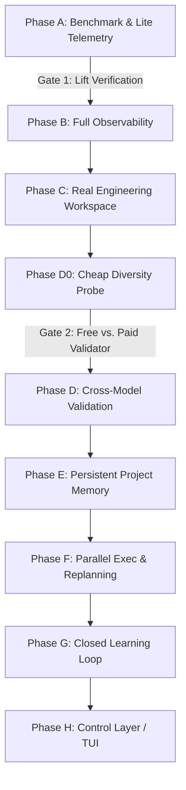

# OIL Intelligence Operating System: Unified & Re-Versioned Roadmap

This document establishes the unified engineering roadmap for the **Obsidian Intelligence Layer (OIL)**, rebased on the active codebase at commit `4bf6db0`. It incorporates the structural planning feedback from ChatGPT and the engineering refinements from Claude, prioritizing deterministic measurement, cost-benefit analysis, safety boundaries, and incremental extension over rebuilds.

---

## 1. Architectural Baseline (Commit `4bf6db0`)

Every roadmap phase is constrained to extend the existing subsystems located under `projects/obsidian-intelligence-layer/src/`:
* **Orchestration & Router:** `core/llm_engine.py`, `core/router.py`, and `core/complexity.py` (heuristic classification).
* **Planning & Execution:** `core/planner.py` (Kahn topological sorting) and `core/agent_manager.py` (BaseAgent / depth-guarded Broker).
* **Memory & Storage:** `core/memory_index.py` (semantic cosine indexing), `core/document_store.py` (chunked local RAG), and `core/db.py` (SQLite registry).
* **Validation & Safety:** `core/verification.py` (refine loop), `core/verifiers.py` (Schema/Code/Critic), `core/sandbox.py` (isolated subprocess), and `core/tools/policy.py` (default-deny risk-tiered rules).
* **Evaluation:** `core/eval/harness.py` (JSONL runs tracking) and `core/curator.py` (vault deduplication).

---

## 2. Global Standing Rules

1. **The Tech-Debt Budget:** With every phase, 15% of engineering effort must be allocated to cleaning/quarantining Layer-B and Layer-C legacy strata (e.g. legacy workflow classification and manual text logs) to prevent them from entangling the intelligent core.
2. **Safety by Default:** Any file modification or execution tool must inherit the default-deny policy in `core/tools/policy.py`. Risk escalation must write to the `escalation` queue rather than executing on the host.
3. **No Rebuilding:** Core components such as the topological planner, cosine ranking, and the provider router's circuit breaker must be extended via composition/hooks, never rewritten.

---

## 3. The Re-Versioned Execution Roadmap

---

### Phase A — System Snapshot & Orchestration Lift Benchmark
* **Goal:** Determine whether the multi-agent orchestration loop actually outperforms a well-formed single model call on a cost-adjusted basis.
* **1. Measurable Capability Added:**
  * Quantifiable performance metrics comparing planning/execution pipelines against single-prompt baselines.
  * **Lite Telemetry Integration:** Call-counter, latency metrics, and prompt/completion token estimators injected directly into `core/router.py` to prevent circular dependencies in Phase B.
* **2. Subsystems Extended:**
  * `core/eval/harness.py` and `core/eval/cases.jsonl` (expanded to support multi-step reasoning, coding, and architecture tasks).
  * `core/router.py` (injects lite token/call trackers).
* **3. Execution & Success Metrics:**
  * **Cost-Adjusted Lift ($L_c$):**
    $$L_c = \frac{Score_{\text{pipeline}} - Score_{\text{baseline}}}{\text{Total Cost of Pipeline}}$$
  * **Baseline Fairness:** The baseline run must use a highly optimized, single-system prompt containing the same reference context and matched to a comparable output token budget on the same model tier (`qwen3-coder:480b-cloud`).
  * **Variance Defense:** Run evaluations with $K \geq 3$ trials per category to establish confidence intervals and rule out non-deterministic LLM variance.
  * **Success Criteria:** Establish a definitive, cost-adjusted lift baseline across 5 categories. The harness must support returning a negative lift, providing a data-driven trigger to descope underperforming agent pathways.

---

### Phase B — Observability & Tracing
* **Goal:** Make every execution fully explainable, replayable, and auditable.
* **1. Measurable Capability Added:**
  * Generation of complete, JSON-serialized execution traces that capture every delegation, tool call, prompt snapshot, router failover, and verification step.
* **2. Subsystems Extended:**
  * `core/agent_manager.py` (Broker logging hook).
  * `core/verification.py` (capturing verification feedback cycles).
  * `core/tools/loop.py` (tracing individual tool execution parameters).
* **3. Execution & Success Metrics:**
  * **Auditability:** 100% of tasks run through `Planner.run` or `AgentManager.execute_task` generate a standard `trace_<id>.json` in `runtime/traces/`.
  * **Replay Accuracy:** A diagnostic script can read any trace of steps and replicate the exact state/inputs of any sub-agent call in the sequence.

---

### Phase C — Real Engineering Workspace
* **Goal:** Enable the agent system to build and test code directly in physical file structures rather than returning markdown artifacts.
* **1. Measurable Capability Added:**
  * Automated codebase modifications, repository setup, workspace directory isolation, compilation checks, and execution of local test suites (e.g. running `pytest` or `npm test`).
* **2. Subsystems Extended:**
  * `core/sandbox.py` (incorporating Docker isolation).
  * `agents/development_agent.py` (interfacing with physical workspaces).
  * `core/tools/builtin.py` (workspace-aware file and terminal tools).
* **3. Execution & Success Metrics:**
  * **Security Compliance:** Any modification tool uses `Risk.DANGEROUS` within `core/tools/policy.py`. High-risk commands (e.g., executing shell scripts outside the sandbox or raw host writes) are blocked by default and trigger a human escalation gate in `runtime/escalations.md`.
  * **Sandbox Overhead Optimization:** Docker containers are spun up **only** for `DANGEROUS` operations; routine file manipulation/Python validation runs in the lightweight `python -I` sandbox to prevent WSL2 memory thrashing.
  * **Success Metric:** Buildable artifact rate (percentage of generated project structures that build and pass all unit tests autonomously) $\geq 80\%$.

---

### Phase D0 — Cheap Diversity Probe
* **Goal:** Verify whether cross-model verification yields any performance benefit before committing to paid API endpoints.
* **1. Measurable Capability Added:**
  * Local cross-model verification loops that compare critique output between different model families.
* **2. Subsystems Extended:**
  * `core/verification.py` and `core/verifiers.py` (CriticVerifier).
  * `core/router.py` (routing specific verifier requests to secondary local/free models).
* **3. Execution & Success Metrics:**
  * **Success Metric:** Measuring the percentage of bugs caught by a secondary model (e.g., a local `llama3.2:3b` or `phi-3`) that were missed by Claude/Qwen self-critique. If this delta is $\leq 5\%$, Phase D (Paid APIs) is postponed or bypassed.

---

### ⟨ REVIEW GATE: FREE-VS-PAID DECISION ⟩
*A coordinator review gate to analyze Phase D0 outcomes. The decision is made whether to proceed with paid APIs (Claude Sonnet / Gemini Pro) for verification or stick to local/free model diversity.*

---

### Phase D — Cross-Model Validation
* **Goal:** Implement true model diversity for verification to break agent monoculture.
* **1. Measurable Capability Added:**
  * Cross-model validation pipelines where generation is executed by one model (e.g., Claude) and validation is performed by another (e.g., Gemini) with large-context validation.
* **2. Subsystems Extended:**
  * `core/verifiers.py` (CriticVerifier).
  * `core/eval/graders.py` (introducing validation schemas).
* **3. Execution & Success Metrics:**
  * **Role Allocation:** Use Gemini's high-context window to index specifications and documentation; use Claude for code generation. Gemini evaluates Claude's code against the specifications.
  * **Checklist Grading:** Subjective research/architecture evaluations utilize deterministic rubric-checklists before defaulting to a same-model LLM-judge (which is inherently biased).
  * **Success Metric:** Capture rate of logical and design errors (errors missed by the code generator's self-critique but caught by the diverse model validator) $\geq 25\%$.

---

### Phase E — Persistent Project Memory
* **Goal:** Maintain project state, operational constraints, decisions, and outcomes across weeks and months instead of single-session runs.
* **1. Measurable Capability Added:**
  * Cross-session state persistence, allowing the system to recall previous architectural decisions and avoid repeating failed tasks.
* **2. Subsystems Extended:**
  * `core/db.py` (SQLite schema expansion).
  * `core/memory_index.py` (semantic historical lookup).
* **3. Execution & Success Metrics:**
  * **Data Model:** Store project entities, metadata, decisions, rejected designs, and verified artifacts inside `oil.sqlite`.
  * **Success Metric:** Recall accuracy (Retrieval@3 contains the exact design decision made in a past session when queried semantically) $\geq 85\%$.

---

### Phase F — Parallel Execution & Dynamic Replanning
* **Goal:** Reduce wall-clock execution time for complex plans and support self-healing loops.
* **1. Measurable Capability Added:**
  * Concurrency in planning loops (executing independent task tracks simultaneously) and runtime replanning when a step fails.
* **2. Subsystems Extended:**
  * `core/planner.py` (topological dependency execution loop).
  * `core/agent_manager.py` (asynchronous agent dispatching).
* **3. Execution & Success Metrics:**
  * **Resilience:** If a sub-step execution fails after $N$ auto-repair attempts, the Planner pauses downstream dependencies, runs a replanning prompt, updates the topological sort, and resumes execution.
  * **Success Metric:** Wall-clock time reduction for 5+ step plans $\geq 35\%$ under concurrent execution, with zero plan-run failures due to dependency starvation.

---

### Phase G — Closed Learning Loop
* **Goal:** Allow the system to optimize its own templates and routing rules based on performance history.
* **1. Measurable Capability Added:**
  * Self-correcting prompt templates and routing tables derived from aggregated eval outcomes and validation histories.
* **2. Subsystems Extended:**
  * `core/router.py` (dynamic model-score ranking).
  * `core/curator.py` (extending from vault cleaning to template cleaning).
* **3. Execution & Success Metrics:**
  * **Stability Guardrails:** Any self-tuning modification must be evaluated against the baseline eval harness (`run_eval`). If the pass rate drops or cost-adjusted lift decreases, the change is instantly reverted.
  * **Data-First Tuning:** Limit self-improvement to updating decomposition heuristics, agent descriptions, and memory-injection templates before allowing modifications to code or core system prompts.
  * **Success Metric:** Positive growth of $L_c$ over a 30-day operational cycle.

---

### Phase H — Intelligence OS Control Layer
* **Goal:** Provide a centralized command center for monitoring system cost, latency, agent executions, and human approvals.
* **1. Measurable Capability Added:**
  * A full-featured Terminal User Interface (TUI) providing real-time visibility into the execution graph, cost trackers, and approval pipelines.
* **2. Subsystems Extended:**
  * `src/main.py` (CLI replacement).
  * Integrates with `core/escalation.py` and trace endpoints.
* **3. Execution & Success Metrics:**
  * **Technology Stack:** Built using Python's `Textual` library to maintain the lightweight, local-first footprint (avoiding Electron/web dependencies).
  * **Control Workflows:** Human coordinator can pause running DAG loops, edit variable payloads mid-flight, and review/approve `DANGEROUS` tools dynamically.
  * **Success Metric:** 100% of human interventions occur within the TUI without manual file editing.
