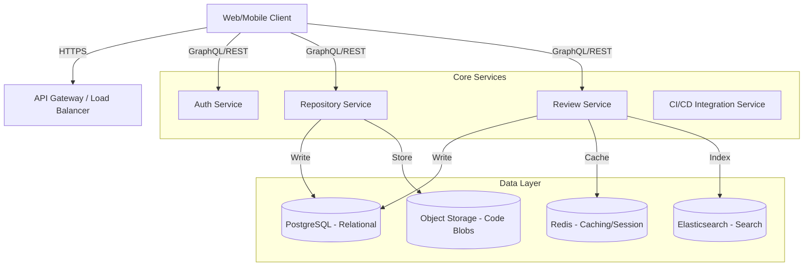

# Knowledge Distillation

Date:
2026-06-02 21:59:55.175666

Task:
Design a code review platform

Outcome:
Here is a comprehensive design proposal for a **Code Review Platform**, structured to be scalable, secure, and developer-centric.

---

### 1. Recommended Approach

**Philosophy:**
The platform should prioritize **clarity, speed, and auditability**. Code review is a social engineering process as much as a technical one. The design must minimize friction for reviewers while maximizing security and traceability.

**Core Strategy:**
1.  **MVP First:** Focus on the core loop: Pull Request (PR) creation, Diff visualization, Commenting, and Approval.
2.  **Git-Agnostic:** Support multiple version control systems (Git, Mercurial, SVN) to ensure flexibility.
3.  **Security-First:** All code is sensitive. Implement strict RBAC (Role-Based Access Control) and immutable audit logs.
4.  **Integration Native:** The platform must act as a "hub," not a "replacement." It should integrate with CI/CD pipelines (GitHub Actions, Jenkins, GitLab CI).

**Key Features for MVP:**
*   Repository & Branch Management.
*   Syntax Highlighted Diff Viewer.
*   Inline Comments & Mentions.
*   Approval Workflows (Required vs. Optional).
*   User Reputation/Trust Score (based on review history).

---

### 2. Architecture

The architecture should be **event-driven** and **microservices-oriented** to handle high concurrency (e.g., thousands of concurrent diffs).

#### **High-Level Diagram**

#### **Component Breakdown**

1.  **Frontend (React/Next.js):**
    *   **Diff Engine:** Custom implementation using `git-diff` or `unified-diff` libraries to render line-by-line changes.
    *   **State Management:** Optimistic UI updates for comments/approvals.
    *   **Diff Highlighting:** Syntax highlighting (Prism.js or Ace Editor).

2.  **Backend (Go/Node.js/Python):**
    *   **API Gateway:** Handles rate limiting, auth, and routing.
    *   **Auth Service:** JWT/OAuth2, MFA support.
    *   **Review Service:** Handles the logic of comments, approvals, and PR state transitions.
    *   **Diff Service:** Dedicated service to parse code and generate diffs (decoupled from logic).

3.  **Data Storage:**
    *   **PostgreSQL:** Primary data (Users, PRs, Comments, Metadata).
    *   **Redis:** Caching hot PR data, session management, real-time notifications.
    *   **Object Storage (S3/MinIO):** Storing actual code files (blobs) to save DB space.
    *   **Elasticsearch:** Full-text search for code snippets and comments.

4.  **Infrastructure:**
    *   **Kubernetes:** Container orchestration.
    *   **CI/CD:** Automated testing of the platform itself.

---

### 3. Implementation Steps

#### **Phase 1: Foundation & Authentication (Weeks 1-4)**
*   **Goal:** Secure user access and repository management.
*   **Tasks:**
    1.  Set up Kubernetes cluster and CI pipeline for the platform.
    2.  Implement **Auth Service** (Login, JWT, OAuth2 for Git providers).
    3.  Build **Repository Service** to list repos, branches, and users.
    4.  Create basic RBAC (Admin, Reviewer, Contributor).
    5.  Deploy PostgreSQL and Redis.

#### **Phase 2: Core Review Logic (Weeks 5-8)**
*   **Goal:** Enable the creation of PRs and viewing of diffs.
*   **Tasks:**
    1.  Implement **Diff Service**: Integrate `git-diff` logic to generate unified diffs.
    2.  Build **PR Service**: Create, update, and close PRs.
    3.  Implement **Comment Service**: Allow users to post comments on specific lines.
    4.  Create **Approval Workflow**: Logic to track "Approved", "Rejected", or "Pending" states.
    5.  Integrate **Notifications**: Push notifications via Webhooks or Email.

#### **Phase 3: Integration & Performance (Weeks 9-12)**
*   **Goal:** Connect with CI/CD and optimize for scale.
*   **Tasks:**
    1.  **CI/CD Hooks:** Allow PRs to trigger automated tests (e.g., linting, unit tests) before approval.
    2.  **Search Indexing:** Populate Elasticsearch with PR metadata for easy filtering.
    3.  **Caching Strategy:** Cache diffs for frequently accessed repos to reduce DB load.
    4.  **Audit Logging:** Log all review actions (who approved what, when) for compliance.

#### **Phase 4: Advanced Features & Polish (Weeks 13+)**
*   **Goal:** Enhance user experience and analytics.
*   **Tasks:**
    1.  **Analytics Dashboard:** Track review velocity, code quality metrics, and team performance.
    2.  **Code Quality Checks:** Integrate static analysis (SonarQube, ESLint) directly into the review UI.
    3.  **Mobile App:** Build a companion app for on-the-go approvals.
    4.  **Security Audit:** Penetration testing and dependency scanning.

---

### **Critical Technical Considerations**

1.  **Diff Performance:**
    *   Generating diffs for large files can be slow. Implement **streaming diffs** where possible.
    *   Use **Git LFS** (Large File Storage) for binary files to avoid bloating the database.

2.  **Conflict Resolution:**
    *   If two users edit the same line, the system must detect conflicts.
    *   Implement a "Merge Conflict" UI that requires a manual resolution step.

3.  **Security:**
    *   **Data Encryption:** Encrypt code blobs at rest in Object Storage.
    *   **Access Control:** Ensure users can only see code they have permission to access (e.g., `repo:read`).

4.  **Scalability:**
    *   Use **Event-Driven Architecture** (e.g., Kafka) for handling high-volume comment streams and notifications.
    *   Shard the PostgreSQL database by `user_id` or `repo_id` if the user base grows beyond 100k.

This approach ensures the platform is robust, secure, and capable of handling enterprise-scale code review workflows.

Learning:
Here is a comprehensive design proposal for a **Code Review Platform**, structured to be scalable, secure, and developer-centric.

---

### 1. Recommended Approach

**Philosophy:**
The platform should prioritize **clarity, speed, and auditability**. Code review is a social engineering process as much as a technical one. The design must minimize friction for reviewers while maximizing security and traceability.

**Core Strategy:**
1.  **MVP First:** Focus on the core loop: Pull Request (PR) creation, Diff visualization, Commenting, and Approval.
2.  **Git-Agnostic:** Support multiple version control systems (Git, Mercurial, SVN) to ensure flexibility.
3.  **Security-First:** All code is sensitive. Implement strict RBAC (Role-Based Access Control) and immutable audit logs.
4.  **Integration Native:** The platform must act as a "hub," not a "replacement." It should integrate with CI/CD pipelines (GitHub Actions, Jenkins, GitLab CI).

**Key Features for MVP:**
*   Repository & Branch Management.
*   Syntax Highlighted Diff Viewer.
*   Inline Comments & Mentions.
*   Approval Workflows (Required vs. Optional).
*   User Reputation/Trust Score (based on review history).

---

### 2. Architecture

The architecture should be **event-driven** and **microservices-oriented** to handle high concurrency (e.g., thousands of concurrent diffs).

#### **High-Level Diagram**

#### **Component Breakdown**

1.  **Frontend (React/Next.js):**
    *   **Diff Engine:** Custom implementation using `git-diff` or `unified-diff` libraries to render line-by-line changes.
    *   **State Management:** Optimistic UI updates for comments/approvals.
    *   **Diff Highlighting:** Syntax highlighting (Prism.js or Ace Editor).

2.  **Backend (Go/Node.js/Python):**
    *   **API Gateway:** Handles rate limiting, auth, and routing.
    *   **Auth Service:** JWT/OAuth2, MFA support.
    *   **Review Service:** Handles the logic of comments, approvals, and PR state transitions.
    *   **Diff Service:** Dedicated service to parse code and generate diffs (decoupled from logic).

3.  **Data Storage:**
    *   **PostgreSQL:** Primary data (Users, PRs, Comments, Metadata).
    *   **Redis:** Caching hot PR data, session management, real-time notifications.
    *   **Object Storage (S3/MinIO):** Storing actual code files (blobs) to save DB space.
    *   **Elasticsearch:** Full-text search for code snippets and comments.

4.  **Infrastructure:**
    *   **Kubernetes:** Container orchestration.
    *   **CI/CD:** Automated testing of the platform itself.

---

### 3. Implementation Steps

#### **Phase 1: Foundation & Authentication (Weeks 1-4)**
*   **Goal:** Secure user access and repository management.
*   **Tasks:**
    1.  Set up Kubernetes cluster and CI pipeline for the platform.
    2.  Implement **Auth Service** (Login, JWT, OAuth2 for Git providers).
    3.  Build **Repository Service** to list repos, branches, and users.
    4.  Create basic RBAC (Admin, Reviewer, Contributor).
    5.  Deploy PostgreSQL and Redis.

#### **Phase 2: Core Review Logic (Weeks 5-8)**
*   **Goal:** Enable the creation of PRs and viewing of diffs.
*   **Tasks:**
    1.  Implement **Diff Service**: Integrate `git-diff` logic to generate unified diffs.
    2.  Build **PR Service**: Create, update, and close PRs.
    3.  Implement **Comment Service**: Allow users to post comments on specific lines.
    4.  Create **Approval Workflow**: Logic to track "Approved", "Rejected", or "Pending" states.
    5.  Integrate **Notifications**: Push notifications via Webhooks or Email.

#### **Phase 3: Integration & Performance (Weeks 9-12)**
*   **Goal:** Connect with CI/CD and optimize for scale.
*   **Tasks:**
    1.  **CI/CD Hooks:** Allow PRs to trigger automated tests (e.g., linting, unit tests) before approval.
    2.  **Search Indexing:** Populate Elasticsearch with PR metadata for easy filtering.
    3.  **Caching Strategy:** Cache diffs for frequently accessed repos to reduce DB load.
    4.  **Audit Logging:** Log all review actions (who approved what, when) for compliance.

#### **Phase 4: Advanced Features & Polish (Weeks 13+)**
*   **Goal:** Enhance user experience and analytics.
*   **Tasks:**
    1.  **Analytics Dashboard:** Track review velocity, code quality metrics, and team performance.
    2.  **Code Quality Checks:** Integrate static analysis (SonarQube, ESLint) directly into the review UI.
    3.  **Mobile App:** Build a companion app for on-the-go approvals.
    4.  **Security Audit:** Penetration testing and dependency scanning.

---

### **Critical Technical Considerations**

1.  **Diff Performance:**
    *   Generating diffs for large files can be slow. Implement **streaming diffs** where possible.
    *   Use **Git LFS** (Large File Storage) for binary files to avoid bloating the database.

2.  **Conflict Resolution:**
    *   If two users edit the same line, the system must detect conflicts.
    *   Implement a "Merge Conflict" UI that requires a manual resolution step.

3.  **Security:**
    *   **Data Encryption:** Encrypt code blobs at rest in Object Storage.
    *   **Access Control:** Ensure users can only see code they have permission to access (e.g., `repo:read`).

4.  **Scalability:**
    *   Use **Event-Driven Architecture** (e.g., Kafka) for handling high-volume comment streams and notifications.
    *   Shard the PostgreSQL database by `user_id` or `repo_id` if the user base grows beyond 100k.

This approach ensures the platform is robust, secure, and capable of handling enterprise-scale code review workflows.

